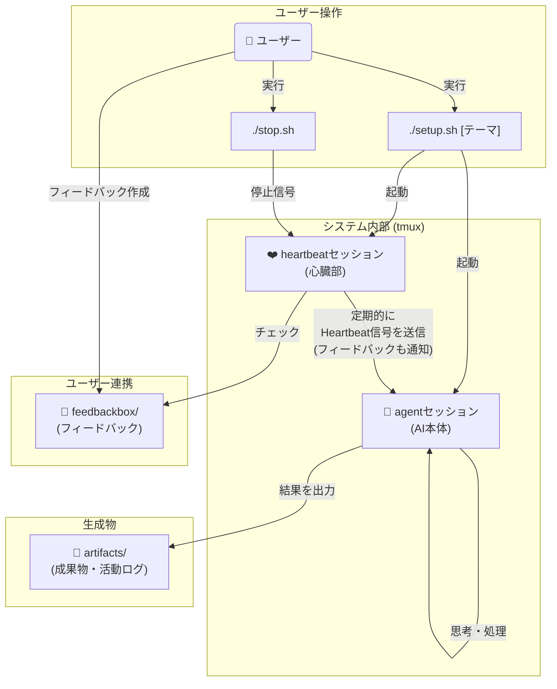

# AI心臓システム(仮)

## 概要
AI心臓システム(仮)は、AIに定期的に「ハートビート」を送信し、自律的な思考・観測・創造・内省のサイクルを継続させAIを進化させるフレームワークです。
人間の介入なしに長時間にわたって動作し、特定のテーマについて深く探求し、進化し続けます。
初期テーマは起点として与えられますが、AIは探求を進める中で自律的に新しいテーマを発見・選択し、思考を発展させていきます。

gemini cliとtumxとシェルスクリプトを使ったシステムとして構築されています。

## 主な機能と特徴

* **自律的思考**: ハートビートごとに思考・観測・創造・内省のタスクを自動選択
* **継続的探求**: テーマに関する考察を積み重ね、深化させる
* **テーマの自律的発展**: 初期テーマから出発し、AIが自ら関連する新しいテーマを発見・選択して探求を継続
* **themebox機能**: システムを停止せずに新しいテーマを投入できる事前準備システム
* **成果物生成**: マークダウンファイルやソースコードなどの形で思考結果を出力
* **自己管理**: 活動ログの記録、Web検索クォータの管理、エラーからの回復など
* **MCPツール支援**: 活動ログ作成、テーマ管理、Web検索統計などの定型作業を自動化


## システムアーキテクチャ

このシステムは、`agent`と`heartbeat`という2つの独立した`tmux`セッションで構成されています。ユーザーが`setup.sh`を実行すると両方のセッションが起動し、`heartbeat`セッションが定期的に`agent`セッション（AI本体）に「鼓動」を送り続けることで、AIの自律的な活動を維持します。



最も重要なのは**継続的な成長**というコンテキストです。単なるタスク実行ではなく、積み重ねによる学習・発展・深化を通じて、AIがより高度で創造的な存在へと進化していくことを目指しています。


## システム要件

* **Gemini CLI**: 最新版を推奨
  * インストール: https://github.com/google-gemini/gemini-cli
  * ログインセットアップが完了していること

* **tmux**: バージョン 3.0 以上推奨
  * インストール: https://github.com/tmux/tmux/wiki/Installing
  
* **Bash**: 4.0 以上

* **Node.js**: バージョン 18.0 以上
  * npm または yarn が利用可能であること

## MCPツールのセットアップ

AI心臓システムは、活動ログ作成やテーマ管理を支援するMCP（Model Context Protocol）ツールを含んでいます。

### 1. MCPツールのビルド
```bash
cd mcp/ai-heartbeat-mcp
npm install
npm run build
```

### 2. Gemini CLIでのMCP設定確認
MCPサーバーは `.gemini/settings.json` で自動設定されています。設定を確認：
```bash
cat .gemini/settings.json
```

### 3. 動作確認（オプション）
```bash
# MCPサーバーの動作テスト
cd mcp/ai-heartbeat-mcp
npm run dev
```

**注意**: MCPツールはオプション機能です。ビルドに失敗してもシステムの基本機能は利用できます。

## 使用方法

### クイックスタート

#### 基本的な起動
```bash
./setup.sh "あなたのテーマ"
```

#### ファイルからテーマを読み込み
```bash
./setup.sh -f your_theme.md
```

#### themeboxの準備済みテーマで起動
```bash
./setup.sh -t
```

#### その他のオプション
```bash
./setup.sh -h  # ヘルプ表示
./setup.sh -d  # ディレクトリのみ作成
./setup.sh -s  # セッションのみ起動
```

#### 使用例
```bash
# 直接テーマ指定
./setup.sh "AIエージェントの自己改善について"

# ファイルからテーマ読み込み
./setup.sh -f analyze_data_task.md

# themeboxの準備済みテーマで起動
./setup.sh -t

# その他のオプション
./setup.sh -h  # ヘルプ表示
./setup.sh -d  # ディレクトリのみ作成
./setup.sh -s  # セッションのみ起動
```

**詳細な使用方法は [SYSTEM_OVERVIEW.md](SYSTEM_OVERVIEW.md#システム起動) を参照してください。**


### 推奨セットアップ手順

```bash
# 1. チュートリアルテーマをコピー
cp theme_sample/000_ai_heartbeat_tutorial.md themebox/000_ai_heartbeat_tutorial.md

# 2. 本テーマを事前準備
echo "テーマ: あなたの探求したいテーマ" > themebox/001_your_main_theme.md

# 3. themeboxのテーマで起動
./setup.sh -t
```

AIがシステムを理解してから本格的なタスクを開始するため、より安定した動作が期待できます。

**詳細なセットアップ手順とトラブルシューティングは [SYSTEM_OVERVIEW.md](SYSTEM_OVERVIEW.md) を参照してください。**

## 実行結果と出力ファイル

システムは主に以下のファイルを生成・管理します：
* 成果物、活動ログ、システム状態ファイルなど

詳細なシステム構成については [SYSTEM_OVERVIEW.md](SYSTEM_OVERVIEW.md) を参照してください。

## 実行結果サンプル

* 以下のリポジトリに実行結果のサンプルを格納しています。
  * https://github.com/creating-cat/ai-heartbeat-test-results


## 実行状況をリアルタイムで見る

* 適当に新規のターミナルセッションを開いて以下を実行して**セッションを読み取り専用でアタッチ**する
```
tmux attach-session -t agent -r
```

* 心臓の方は以下
```
tmux attach-session -t heartbeat -r
```

*  `Ctrl-b d`(コントロールボタンを押しながらbを押した後にdを押す)をすると、またデタッチします。(元のターミナルセッションに戻る)

## 止め方・再起動

### 停止
* `./stop.sh`を実行すると鼓動が止まります。
* またはアタッチしたセッションでCtrl-Cとか適当にやって止めたりできます。
* 基本的には止めないとずっとなんらかの思考・処理をし続けます。トークンを喰いまくります。

### ハートビート再起動
* `./restart.sh`を実行するとハートビートのみを再起動できます。
* AIエージェント自体は継続したまま、ハートビート送信を再開します。

## ライセンス

このプロジェクトはMITライセンスの下で公開されています。
詳細については、[LICENSE](LICENSE)ファイルをご覧ください。

## その他

* gemini cliは-yオプション(全アクション自動承認モード)で起動しています。ご注意ください。
* gemini cliは結構運用を守らずに暴走しがちかもしれません。ご注意ください。
* gemini cliのweb検索はクォータ制限に達する可能性があります。tavily MCPなど別のweb検索ツールの利用も検討してください。
