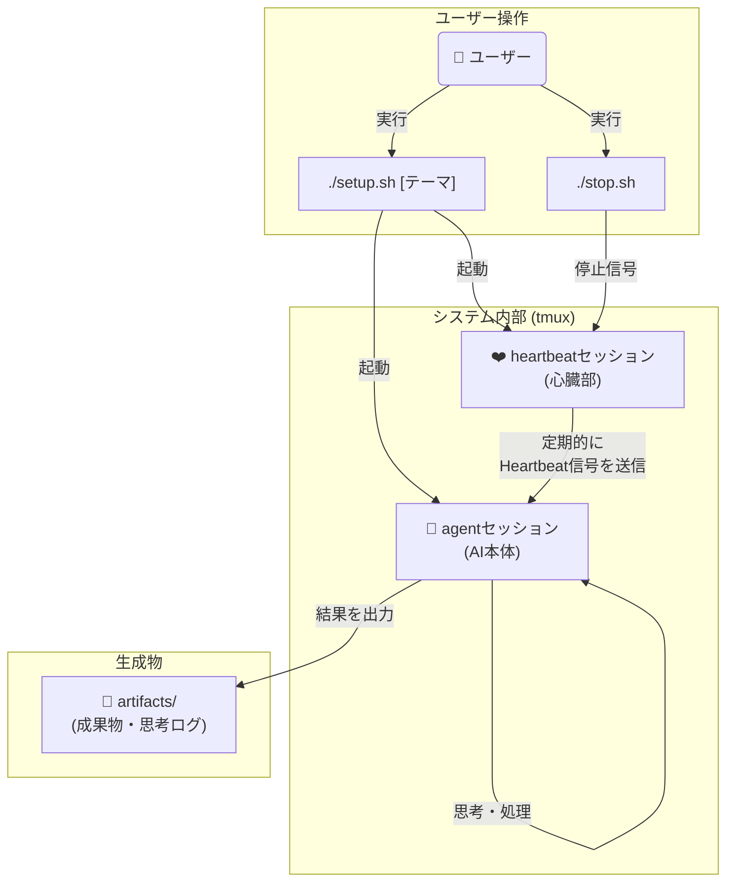

# AI心臓システム(仮)

## 概要
AI心臓システム(仮)は、AIに定期的に「ハートビート」を送信し、自律的な思考・観測・創造・内省のサイクルを継続させAIを進化させるフレームワークです。
人間の介入なしに長時間にわたって動作し、特定のテーマについて深く探求し、進化し続けます。
初期テーマは起点として与えられますが、AIは探求を進める中で自律的に新しいテーマを発見・選択し、思考を発展させていきます。

## 主な機能と特徴

* **自律的思考**: ハートビートごとに思考・観測・創造・内省のタスクを自動選択
* **継続的探求**: テーマに関する考察を積み重ね、深化させる
* **テーマの自律的発展**: 初期テーマから出発し、AIが自ら関連する新しいテーマを発見・選択して探求を継続
* **themebox機能**: システムを停止せずに新しいテーマを投入できる事前準備システム
* **テーマ履歴追跡**: テーマの開始・終了を自動記録し、長期的な探求の変遷を追跡
* **成果物生成**: マークダウンファイルやソースコードなどの形で思考結果を出力
* **自己管理**: 思考ログの記録、Web検索クォータの管理、エラーからの回復など


## システムアーキテクチャ

このシステムは、`agent`と`heartbeat`という2つの独立した`tmux`セッションで構成されています。ユーザーが`setup.sh`を実行すると両方のセッションが起動し、`heartbeat`セッションが定期的に`agent`セッション（AI本体）に「鼓動」を送り続けることで、AIの自律的な活動を維持します。



最も重要なのは**継続的な成長**というコンテキストです。単なるタスク実行ではなく、積み重ねによる学習・発展・深化を通じて、AIがより高度で創造的な存在へと進化していくことを目指しています。


## システム要件

* **Gemini CLI**: 最新版を推奨
  * インストール: https://github.com/google-gemini/gemini-cli
  * ログインセットアップが完了していること

* **tmux**: バージョン 3.0 以上推奨
  * インストール: https://github.com/tmux/tmux/wiki/Installing
  
* **Bash**: 4.0 以上

## 実行方法

```
./setup.sh [思考・処理させる内容]
```

## 使用例
* 初期テーマはシンプルにした方がいいかもしれません。その方がいろんなテーマを渡り歩いて良いかもです。

### 哲学的テーマの探求
```
./setup.sh "AIエージェントの自己改善について"
```

### 技術的分析
```
./setup.sh "量子コンピューティングの現状と未来について考察してください"
```

### 創造的タスク
```
./setup.sh "html css javascriptを用いていろんなゲームが遊べるサイトを構築してください"
```

### その他の例
```
./setup.sh "テーマ: お笑いの本質について"
```

## 実行結果と出力ファイル

システムは主に以下のファイルを生成・管理します：
* 成果物、思考ログ、システム状態ファイルなど

詳細なシステム構成については [SYSTEM_OVERVIEW.md](SYSTEM_OVERVIEW.md) を参照してください。

## 実行状況をリアルタイムで見る

* 適当に新規のターミナルセッションを開いて以下を実行してセッションをアタッチする
```
tmux attach-session -t agent
```

* 心臓の方は以下
```
tmux attach-session -t heartbeat
```

*  `Ctrl-b d`(コントロールボタンを押しながらbを押した後にdを押す)をすると、またデタッチします。(元のターミナルセッションに戻る)

## 止め方・再起動

### 停止
* `./stop.sh`を実行すると鼓動が止まります。
* またはアタッチしたセッションでCtrl-Cとか適当にやって止めたりできます。
* 基本的には止めないとずっとなんらかの思考・処理をし続けます。トークンを喰いまくります。

### ハートビート再起動
* `./restart.sh`を実行するとハートビートのみを再起動できます。
* AIエージェント自体は継続したまま、ハートビート送信を再開します。

## themebox機能（テーマ事前準備）

システムを停止せずに新しいテーマを投入できる機能です。`themebox/`ディレクトリにマークダウンファイルを作成すると、AIがテーマ移行時に自動選択します。

## テーマ履歴追跡システム

AIの長期的な探求の変遷を自動記録・追跡するシステムです。テーマの開始・終了が自動記録され、AIの成長過程を可視化できます。

## ライセンス

このプロジェクトはMITライセンスの下で公開されています。
詳細については、[LICENSE](LICENSE)ファイルをご覧ください。

## その他

* geminiは-yオプション(全アクション自動承認モード)で起動しています。ご注意ください。
* geminiは結構運用を守らずに暴走しがちかもしれません。ご注意ください。
* geminiのweb検索はクォータ制限に達する可能性があります。tavily MCPなど別のweb検索ツールの利用も検討してください。