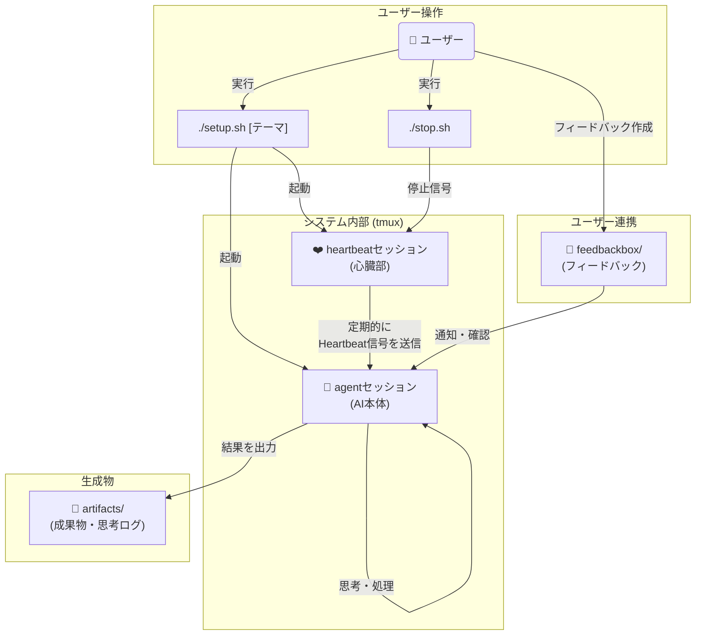

# AI心臓システム(仮)

## 概要
AI心臓システム(仮)は、AIに定期的に「ハートビート」を送信し、自律的な思考・観測・創造・内省のサイクルを継続させAIを進化させるフレームワークです。
人間の介入なしに長時間にわたって動作し、特定のテーマについて深く探求し、進化し続けます。
初期テーマは起点として与えられますが、AIは探求を進める中で自律的に新しいテーマを発見・選択し、思考を発展させていきます。

gemini cliとtumxとシェルスクリプトを使ったシステムとして構築されています。

## 主な機能と特徴

* **自律的思考**: ハートビートごとに思考・観測・創造・内省のタスクを自動選択
* **継続的探求**: テーマに関する考察を積み重ね、深化させる
* **テーマの自律的発展**: 初期テーマから出発し、AIが自ら関連する新しいテーマを発見・選択して探求を継続
* **themebox機能**: システムを停止せずに新しいテーマを投入できる事前準備システム
* **テーマ履歴追跡**: テーマの開始・終了を自動記録し、長期的な探求の変遷を追跡
* **feedbackboxシステム**: ユーザーからの非同期フィードバックによるAIの一貫性・品質向上支援
* **成果物生成**: マークダウンファイルやソースコードなどの形で思考結果を出力
* **自己管理**: 思考ログの記録、Web検索クォータの管理、エラーからの回復など


## システムアーキテクチャ

このシステムは、`agent`と`heartbeat`という2つの独立した`tmux`セッションで構成されています。ユーザーが`setup.sh`を実行すると両方のセッションが起動し、`heartbeat`セッションが定期的に`agent`セッション（AI本体）に「鼓動」を送り続けることで、AIの自律的な活動を維持します。



最も重要なのは**継続的な成長**というコンテキストです。単なるタスク実行ではなく、積み重ねによる学習・発展・深化を通じて、AIがより高度で創造的な存在へと進化していくことを目指しています。


## システム要件

* **Gemini CLI**: 最新版を推奨
  * インストール: https://github.com/google-gemini/gemini-cli
  * ログインセットアップが完了していること

* **tmux**: バージョン 3.0 以上推奨
  * インストール: https://github.com/tmux/tmux/wiki/Installing
  
* **Bash**: 4.0 以上

## 使用方法


### クイックスタート

#### 基本的な起動
```bash
./setup.sh "あなたのテーマ"
```

#### ファイルからテーマを読み込み
```bash
./setup.sh -f themebox/your_theme.md
```

#### その他のオプション
```bash
./setup.sh -h  # ヘルプ表示
./setup.sh -d  # ディレクトリのみ作成
./setup.sh -s  # セッションのみ起動
```

#### 使用例
```bash
./setup.sh "AIエージェントの自己改善について"
./setup.sh "html css javascriptを用いていろんなゲームが遊べるサイトを構築してください"
./setup.sh -f themebox/001_analyze_data.md
```

**詳細な使用方法は [SYSTEM_OVERVIEW.md](SYSTEM_OVERVIEW.md#システム起動) を参照してください。**


### 推奨セットアップ手順
以下の手順で実施することで、AIエージェントがシステムを深く理解し、より安定した動作が期待できます。

1. **チュートリアルテーマを準備**
   ```bash
   # テンプレートからチュートリアルテーマを作成
   cp themebox/draft.sample.000_ai_heartbeat_tutorial.md themebox/000_ai_heartbeat_tutorial.md
   ```

2. **本テーマを事前準備**
   ```bash
   # 本テーマファイルを作成（例）
   echo "テーマ: 量子コンピューティングの現状と未来について考察してください" > themebox/001_your_main_theme.md
   ```

3. **チュートリアルテーマで起動**
   ```bash
   ./setup.sh -f themebox/000_ai_heartbeat_tutorial.md
   ```

4. **自動的な流れ**
   - AIがシステム理解を深める（チュートリアル）
     - おおよそ5〜10分程度でこのチュートリアルテーマの活動は終わるはずです。
   - チュートリアルテーマ活動完了後、自動的に001_your_main_theme.mdのテーマ活動に移行
   - システム理解が深まった状態で本格的なタスクを開始

この手順により、AIがGEMINI.mdやai-docs/配下の運用ルールを深く理解し、適切な思考ログ記録やファイル操作ルールの遵守が期待できます。


## 実行結果と出力ファイル

システムは主に以下のファイルを生成・管理します：
* 成果物、思考ログ、システム状態ファイルなど

詳細なシステム構成については [SYSTEM_OVERVIEW.md](SYSTEM_OVERVIEW.md) を参照してください。

## 実行結果サンプル

* 以下のリポジトリに実行結果のサンプルを格納しています。
  * https://github.com/creating-cat/ai-heartbeat-test-results


## 実行状況をリアルタイムで見る

* 適当に新規のターミナルセッションを開いて以下を実行してセッションをアタッチする
```
tmux attach-session -t agent
```

* 心臓の方は以下
```
tmux attach-session -t heartbeat
```

*  `Ctrl-b d`(コントロールボタンを押しながらbを押した後にdを押す)をすると、またデタッチします。(元のターミナルセッションに戻る)

## 止め方・再起動

### 停止
* `./stop.sh`を実行すると鼓動が止まります。
* またはアタッチしたセッションでCtrl-Cとか適当にやって止めたりできます。
* 基本的には止めないとずっとなんらかの思考・処理をし続けます。トークンを喰いまくります。

### ハートビート再起動
* `./restart.sh`を実行するとハートビートのみを再起動できます。
* AIエージェント自体は継続したまま、ハートビート送信を再開します。

## themebox機能（テーマ事前準備）

システムを停止せずに新しいテーマを投入できる機能です。`themebox/`ディレクトリにマークダウンファイルを作成すると、AIがテーマ移行時に自動選択します。

## テーマ履歴追跡システム

AIの長期的な探求の変遷を自動記録・追跡するシステムです。テーマの開始・終了が自動記録され、AIの成長過程を可視化できます。

## feedbackboxシステム（ユーザーフィードバック）

AIが長期間活動する中で忘れてしまった情報や矛盾を指摘するためのシステムです。

### 基本的な使用方法

1. **フィードバック作成**
   ```bash
   # ドラフトとして作成（AIは無視）
   echo "# 方針の矛盾について
   昨日の「シンプル重視」と今日の複雑な機能追加が矛盾しています。" > feedbackbox/draft.001_direction_issue.md
   ```

2. **フィードバック有効化**
   ```bash
   # draft.プレフィックスを削除して有効化
   mv feedbackbox/draft.001_direction_issue.md feedbackbox/001_direction_issue.md
   ```

3. **自動処理**
   - AIがハートビートで通知を受け取る
   - 内省時にフィードバックを確認・対応
   - 確認後、ファイルが`processed.001_direction_issue.md`に自動リネーム

### フィードバック例
- 過去の決定との矛盾の指摘
- 既存リソースの見落としの指摘
- 方針や目標の再確認要請
- 重要な情報の思い出し支援

## ライセンス

このプロジェクトはMITライセンスの下で公開されています。
詳細については、[LICENSE](LICENSE)ファイルをご覧ください。

## その他

* gemini cliは-yオプション(全アクション自動承認モード)で起動しています。ご注意ください。
* gemini cliは結構運用を守らずに暴走しがちかもしれません。ご注意ください。
* gemini cliのweb検索はクォータ制限に達する可能性があります。tavily MCPなど別のweb検索ツールの利用も検討してください。
