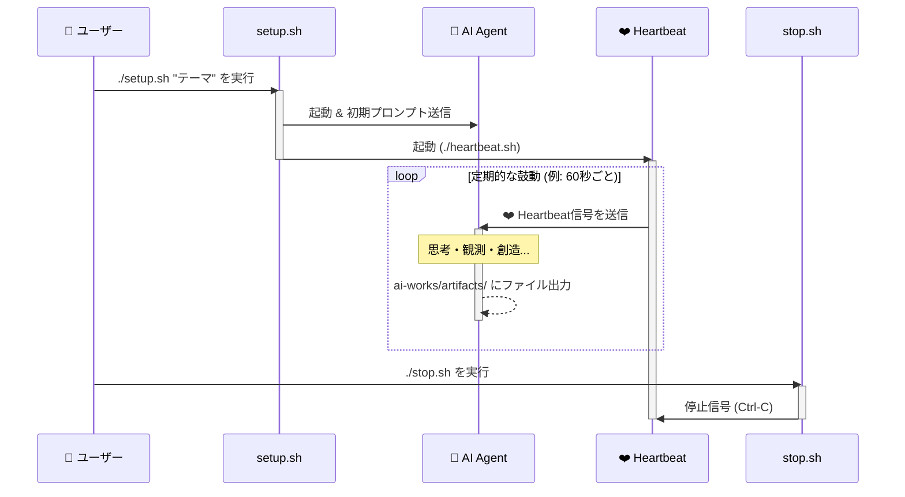

# AI心臓システム システム概要

このドキュメントでは、AI心臓システムの全体像、アーキテクチャ、および各コンポーネントの役割と機能について詳細に説明します。システムの動作原理と技術的な詳細を理解するためのガイドとしてご活用ください。

## システム概要

AI心臓システムは、定期的な「ハートビート」によりAIの継続的な思考・創造活動を促し、**AIの成長と進化を実現する**フレームワークです。単なる活動継続ではなく、積み重ねによる学習・発展・深化を通じて、AIがより高度で創造的な存在へと進化することを目指しています。

### 成長・進化のメカニズム
1. **継続的思考**: 中断のない思考サイクルにより深い洞察を獲得
2. **経験の蓄積**: 活動ログと成果物により過去の学習を活用
3. **テーマの発展**: 初期テーマから自律的に新しい探求領域を発見
4. **内省による改善**: システム運用と創造的成長の両面から自己評価と振り返りにより思考パターンを洗練
5. **創造性の向上**: 継続的な創造活動により表現力と発想力を拡張
6. **問題解決能力**: 異常検知・回復体験により自律性を強化

### 基本的な動作フロー
1. **起動**: `setup.sh`でシステム初期化・AIエージェント起動
2. **ハートビート送信**: `heartbeat.sh`が60秒ごとにAIに成長の機会を提供
3. **自律処理**: AIが`GEMINI.md`のルールに従って思考・観測・創造・内省を実行
4. **成果物生成**: `artifacts/`配下に思考の軌跡と創造の結果を蓄積
5. **テーマ進化**: 自動的なテーマ移行により探求領域を拡張
6. **自己回復**: 異常検知・回復体験により問題解決能力を向上

### 主要コンポーネント
- **AIエージェント**: Gemini CLIによる進化する思考主体
- **ハートビート**: 継続的な成長機会の提供システム
- **ルールエンジン**: GEMINI.mdとai-docs/による進化的動作制御
- **テーマ管理**: themebox/とテーマ履歴による探求領域の拡張
- **成長記録**: artifacts/による学習履歴と進化の軌跡管理
- **フィードバック管理**: feedbackbox/によるユーザーとAIの非同期コミュニケーション
- **MCPツール群**: mcp/ai-heartbeat-mcp/による自律的で効率的な活動支援と定型作業の自動化

## ディレクトリ構造

### テンプレートベースの作業環境分離

AI心臓システムは、システム管理領域とAI活動領域を分離したテンプレートベースの構造を採用しています：

- **システム管理領域**: Git管理下でシステムコードとライブラリを管理
- **AI活動環境テンプレート** (`ai-works-lib/`): AI用の設定とドキュメントのテンプレート
- **AI活動領域** (`ai-works/`): 実際のAI作業環境（テンプレートから自動生成）

この構造により、AIは自分の活動履歴と成果物に完全にアクセスでき、システム更新時もAIの作業環境を保護できます。

```
AI心臓システム/
├── setup.sh                    # システム起動スクリプト
├── heartbeat.sh                 # ハートビート送信スクリプト
├── stop.sh                     # システム停止スクリプト
├── restart.sh                  # ハートビート再起動スクリプト
├── README.md                   # プロジェクト概要
├── SYSTEM_OVERVIEW.md           # このドキュメント
├── mcp/                         # Model Context Protocol ツール群
│   └── ai-heartbeat-mcp/        # AI心臓システム専用MCPサーバー
├── ai-works-lib/               # AI活動環境テンプレート
│   ├── GEMINI.md               # AI動作の基本ルール
│   ├── .gemini/                # AI用Gemini CLI設定
│   │   └── settings.json       # MCP設定等
│   └── ai-docs/                # AI向け詳細ドキュメント
│       ├── OPERATION_DETAILS.md    # 運用詳細ガイド
│       ├── GUIDELINES.md           # 運用ガイドライン
│       ├── THEME_MANAGEMENT_GUIDE.md  # テーマ管理ガイド
│       ├── THEME_CONCEPT_GUIDE.md   # テーマ概念ガイド
│       ├── THEME_CONTEXT_IMPLEMENTATION.md # テーマコンテキスト実装
│       ├── MCP_WARNING_GUIDE.md    # MCPツール警告ガイド
│       ├── TOOL_RESTRICTIONS.md    # ツール制限ガイド
│       └── TROUBLESHOOTING_GUIDE.md # トラブルシューティング
├── ai-works/                   # AI活動領域（setup.shで自動生成）
│   ├── themebox/               # テーマ事前準備ディレクトリ
│   │   ├── 001_example_theme.md    # 準備されたテーマ
│   │   ├── draft.002_editing.md    # 編集中（無視される）
│   │   └── processed.000_used.md   # 使用済み（無視される）
├── theme_sample/               # テーマサンプル集
│   ├── 000_ai_heartbeat_tutorial.md  # チュートリアルテーマ
│   └── zzz_summary_of_activities.md  # 活動まとめテーマ
│   ├── feedbackbox/            # ユーザーフィードバック管理
│   │   ├── draft.XXX_title.md      # ドラフト段階（無視）
│   │   ├── XXX_title.md            # 処理対象フィードバック
│   │   └── processed.XXX_title.md  # 処理済みフィードバック
│   ├── artifacts/              # AI生成物保存ディレクトリ
│   │   ├── theme_histories/        # テーマ履歴記録
│   │   │   ├── 20250101120000_start_ai_research.md
│   │   │   └── 20250101140000_end_ai_research.md
│   │   ├── 20250101120000_ai_research/  # テーマディレクトリ例
│   │   │   ├── histories/          # 活動ログ
│   │   │   │   ├── 20250101120000.md
│   │   │   │   └── 20250101130000.md
│   │   │   ├── analysis_report.md  # 成果物例
│   │   │   └── creative_work.html  # 成果物例
│   │   └── 20250101140500_web_development/  # 次テーマディレクトリ例
│   ├── projects/               # AI創造・開発プロジェクト管理
│   │   ├── web_site/              # 新規Webサイト開発プロジェクト例
│   │   ├── original_app/          # 新規アプリ開発プロジェクト例
│   │   └── cloned_opensource_repo/ # クローンした既存リポジトリ例
│   └── stats/                  # システム状態管理
│       ├── cooldown/               # ツールクールダウン管理
│       └── lock/                   # ツールロック管理
```

## 詳細なディレクトリ説明

### ai-works/artifacts/ - AI生成物保存
AIが生成したアウトプットを保存するディレクトリです。テーマごとにサブディレクトリが作成され、その中に活動ログや成果物が保存されます。

### ai-works/stats/ - システム状態管理
Web検索制限などのシステム状態を管理するためのファイルを格納するディレクトリです。

### ai-works/projects/ - AI創造・開発プロジェクト管理
AIが創造活動や開発作業の一環として取り組む具体的なプロジェクトを管理するディレクトリです。新規開発プロジェクトだけでなく、既存リポジトリなどのなんらかのリファレンスの分析・改善作業も含まれます。

**特徴:**
- テーマを超えて継続的に発展するプロジェクトの管理
- 新規プロジェクトの開発と既存プロジェクトの拡張・改善
- プロジェクトごとの独立したディレクトリ構造
- 開発プロセスの記録と成果物の蓄積
- 既存リポジトリとの連携・貢献活動

**用途例:**
- Webサイトの新規構築とデプロイ
- オープンソースプロジェクトへの貢献
- ゲームやツールの開発・カスタマイズ
- 既存リポジトリの分析・改善
- データ分析プロジェクト
- 既存コードベースの学習・理解

### ai-docs/ - AI向け詳細ドキュメント
AI向けの詳細ドキュメントを格納するディレクトリです。GEMINI.mdから分離された詳細ルールや運用ガイドラインが含まれます。

### ai-works/themebox/ - テーマ事前準備
新しいテーマを事前に準備しておくためのディレクトリです。AIがテーマ移行を判断した際に、このディレクトリ内のファイルから次のテーマを自動選択します。

```bash
# テーマファイルを準備
echo "テーマ: 量子コンピューティングの未来について" > ai-works/themebox/001_future_of_cuantum_computing.md

# themeboxの準備済みテーマで起動
./setup.sh -t

# 起動後も追加可能。現在活動中のテーマ活動完了後に新テーマとして自動選択される。
echo "テーマ: 汎用人工知能の未来について" > ai-works/themebox/002_future_of_agi.md
```

ファイル名のプレフィックス (`draft.`, `processed.`) により、AIが処理するファイルを制御できます。詳細は`ai-docs/THEME_MANAGEMENT_GUIDE.md`で定義されています。

## システム起動

AI心臓システムの起動は`setup.sh`スクリプトで行います。

### 基本的な使用方法

```bash
./setup.sh [オプション] <テーマ文字列>
```

### 利用可能なオプション

#### `-f, --file <ファイル>`
指定したファイルから初期テーマを読み込み、themeboxに投入します。

```bash
# 任意のマークダウンファイルから読み込み
./setup.sh -f my_custom_theme.md

# themeboxからテーマファイルを読み込み
./setup.sh -f ai-works/themebox/001_creative_writing.md
```

※ themeboxからテーマファイルを読み込みの場合、読み込み後にファイル名に `processed.` が付加されます。

**用途例:**
- 事前に準備したテーマファイルの使用
- 複雑で長いテーマ指示の管理
- テーマの再利用とバージョン管理

#### `-t, --use-themebox`
themeboxに準備済みのテーマで起動します（テーマ指定は不要）。

```bash
./setup.sh -t
```

**動作詳細:**
- `draft.*`と`processed.*`を除く有効なテーマファイルの存在を自動検証
- 有効なテーマが見つかった場合、システムを起動
- 有効なテーマが見つからない場合、エラーメッセージを表示して終了
- AIが自動的にthemebox内の有効なテーマを選択・実行

**用途例:**
- 事前に複数のテーマを準備してからシステム起動
- テーマ内容を事前に検討・準備してから実行
- 定期的な運用での標準的な起動方法

**themeboxファイル管理:**
- `001_theme.md` → **処理対象**（AIが選択・実行）
- `draft.001_theme.md` → **無視**（編集中のドラフト）
- `processed.001_theme.md` → **無視**（使用済みテーマ）

#### `-d, --dirs-only`
必要なディレクトリのみを作成して終了します（tmuxセッションやエージェントは起動しません）。

```bash
./setup.sh -d
```

**用途例:**
- 初回セットアップ時のディレクトリ準備
- CI/CDパイプラインでの環境準備
- 手動でのシステム構築前の準備

**作成されるディレクトリ:**
- `ai-works/artifacts/` - AI の活動ログと成果物
- `ai-works/themebox/` - テーマファイルの保管場所
- `ai-works/feedbackbox/` - ユーザーフィードバックの管理場所
- `ai-works/projects/` - 開発プロジェクトの作業場所

#### `-s, --sessions-only`
tmuxセッションのみを起動します（geminiおよびheartbeatの起動なし）。

```bash
./setup.sh -s
```

**用途例:**
- システム復旧時の段階的起動
- デバッグやメンテナンス作業
- 手動でのプロセス制御が必要な場合

**手動復帰の手順:**
1. エージェントセッションに接続: `tmux attach-session -t agent`
2. Gemini CLIを手動起動: `gemini -y`
3. 必要に応じて`/chat resume`などを実行
4. ハートビートを手動起動: `./restart.sh`

#### `-h, --help`
ヘルプメッセージを表示します。

```bash
./setup.sh -h
```

### テーマ指定オプションの排他制御

**重要**: 以下のテーマ指定オプションは**1つだけ**選択できます：

| オプション | 説明 |
|-----------|------|
| `<テーマ文字列>` | 直接テーマを指定して起動 |
| `-f, --file <ファイル>` | ファイルからテーマを読み込んで起動 |
| `-t, --use-themebox` | themeboxの準備済みテーマで起動 |

**エラーケース:**
```bash
# ❌ エラー: 複数のテーマ指定オプションを同時使用
./setup.sh "テーマ" -f theme.md
./setup.sh -t -f theme.md
./setup.sh "テーマ" -t

# ❌ エラー: テーマ指定なし（-d, -s以外の場合）
./setup.sh
```

### 基本的な起動パターン

#### 1. 通常起動（推奨）
```bash
./setup.sh "創作活動のテーマ"
```

このコマンドは以下の処理を自動実行します：
1. 必要なディレクトリ作成（artifacts, themebox, feedbackbox, projects）
2. 既存tmuxセッションのクリーンアップ
3. agentセッション作成とGemini CLI起動
4. heartbeatセッション作成とハートビート起動
5. 初期テーマのthemebox投入（`000_initial_theme_${TIMESTAMP}.md`形式）

#### 2. ファイルベース起動
```bash
./setup.sh -f ai-works/themebox/001_analyze_data.md
```

事前に準備したテーマファイルを使用して起動します。

#### 3. themebox準備済みテーマ起動
```bash
./setup.sh -t
```

themeboxに準備済みの有効なテーマで起動します。事前にテーマを検討・準備してから実行する場合に最適です。

#### 4. 段階的起動
```bash
# ステップ1: ディレクトリ準備
./setup.sh -d

# ステップ2: セッション起動
./setup.sh -s

# ステップ3: 手動でプロセス起動
tmux attach-session -t agent
# （agentセッション内で）gemini -y
# （別ターミナルで）./restart.sh
```

## シーケンス図

以下のシーケンス図は、システムの起動から停止までの一連の処理が、時間と共にどのように連携して実行されるかを示しています。



## ログ管理

AI心臓システムは、運用監視とデバッグを支援するため、詳細なログ機能を提供します。

### ログファイルの特徴

#### 自動ログ出力
- **heartbeat.sh**が自動的にログファイルに出力
- **tmuxアタッチ不要**でシステム状況を確認可能
- **リアルタイム監視**と**履歴分析**の両方に対応

#### ファイル名形式
```
logs/heartbeat_YYYYMMDD_HHMMSS.log
```

**例**: `logs/heartbeat_20250106_143022.log` (2025年1月6日 14:30:22 開始)

#### ログレベル
- **[HEARTBEAT]**: ハートビート送信の記録
- **[INFO]**: システム状態の情報
- **[WARNING]**: 異常検知と回復試行
- **[ERROR]**: 重大なエラーと停止処理

### ディレクトリ構造
```
logs/
├── heartbeat_20250106_143022.log    # 14:30:22 開始のセッション
├── heartbeat_20250106_150145.log    # 15:01:45 開始のセッション
├── heartbeat_20250106_162330.log    # 16:23:30 開始のセッション
└── ...
```

### 自動管理機能
- **セッション分離**: 各起動で独立したログファイルを作成
- **自動クリーンアップ**: 30日以上古いログファイルを自動削除
- **ファイル名衝突回避**: ハートビートIDにより重複を防止

### 実用的な使用方法

#### リアルタイム監視
```bash
# 最新のログをリアルタイム監視
tail -f logs/heartbeat_*.log

# 特定のログファイルを監視
tail -f logs/heartbeat_20250106_143022.log
```

#### ログ分析
```bash
# エラーのみ確認
grep "ERROR" logs/heartbeat_*.log

# 回復関連のログ確認
grep -E "(RECOVERY|recovery)" logs/heartbeat_*.log

# 特定日のログ確認
ls logs/heartbeat_20250106_*.log

# 特定時間帯のログ確認
ls logs/heartbeat_*_14*.log  # 14時台開始のセッション
```

#### ログ内容例
```
[2025-01-06 14:30:22] [INFO] Heartbeat started at 2025-01-06 14:30:22 (PID: 12345)
[2025-01-06 14:30:22] [INFO] Log file: logs/heartbeat_20250106_143022.log
[2025-01-06 14:31:22] [HEARTBEAT] Heartbeat sent to agent session
[2025-01-06 14:32:22] [HEARTBEAT] Heartbeat sent to agent session
[2025-01-06 14:40:15] [WARNING] Abnormal activity detected: 無活動状態 (attempt 1/3)
[2025-01-06 14:45:20] [INFO] Agent recovery confirmed. Returning to normal state.
```

この包括的なログ機能により、システムの動作状況を詳細に追跡し、問題の早期発見と効率的なデバッグが可能になります。

## コアファイル

### GEMINI.md
AI心臓システムの中核となる仕様書です。AIの動作原則、処理フロー、活動ログ管理などの基本ルールが記載されています。AIはこのファイルに従って自律的に動作します。

主な内容:
- システムトリガー（ハートビート）の仕組み
- 活動モード/ユーザーモードの処理フロー（ユーザーモードでのテーマ受け取りは廃止）
- 活動ログ記録のルールとフォーマット
- 停止条件とテーマ移行条件
- 運用原則とエラーハンドリング

### heartbeat.sh
AI心臓システムの「鼓動」を生成するスクリプトです。定期的にAIに対してハートビート信号を送信し、自律的な思考を促します。

主な機能:
- 定期的なハートビート（プロンプト）送信
- Web検索制限の管理（クォータ保護）
- 高度な異常検知システム
- ログ出力と状態表示
- 状態管理（通常、回復待機）
- フィードバック通知機能（緊急フィードバック含む）

#### 状態管理
heartbeat.shは、システムの安定性を保つために、自身の状態を管理します。
- **通常状態 (normal)**: 定期的にヘルスチェックとハートビート送信を行います。
- **回復待機状態 (recovery_waiting)**: 異常検知後の回復処理中に移行し、AIの回復を待機します。この間、不要なハートビート送信は抑制されます。

#### フィードバック通知機能
`ai-works/feedbackbox/` ディレクトリを常に監視し、ユーザーからのフィードバックをAIに通知します。
- **通常フィードバック**: 未処理のフィードバックを検知し、ハートビートメッセージに通知を含めます。
- **割り込みフィードバック**: `interrupt.` というプレフィックスを持つファイルを検知した場合、**即座にAIの処理を中断**させ、割り込み処理としてハートビートを送信する強力な介入機能を備えています。

#### 異常検知機能
heartbeat.shは、AIの知的活動の「質」を評価するため、複数の洗練された検知メカニズムでAIの異常状態を監視します。これにより、AIがシステムの設計思想から逸脱することなく、健全に成長し続けることを支援します。

主な検知機能は以下の通りです。詳細は`ai-docs/TROUBLESHOOTING_GUIDE.md`で確認できます。

1.  **活動ログ頻度異常**: 思考活動そのものが一定期間停止していないかを監視します。
2.  **活動ログループ異常**: 同じ活動ログを何度も更新し続ける「完璧主義」のループを検知します。
3.  **内省活動異常**: システム運用と創造的成長の両面からの自己評価と改善のサイクルが滞っていないかを監視します。
5.  **活動ログタイムスタンプ異常**: 古いハートビートIDを使い続けるルール違反を検知します。

#### 自律回復システム
異常検知時に即座に停止せず、自動回復を試行する機能：

- **回復試行**: 各異常に対して最大3回まで回復を試行
- **回復待機**: 回復メッセージ送信後、5サイクル（5分）回復を待機
- **段階的対応**: 回復成功→通常運用継続、回復失敗→次回試行、最大試行超過→停止
- **状態管理**: 通常状態と回復待機状態を適切に管理し、重複処理を防止

### setup.sh
システムの初期設定と起動を行うスクリプトです。tmuxセッションの作成、AIエージェントの起動、初期プロンプトの送信などを行います。

主な機能:
- 既存セッションのクリーンアップ
- agentセッションとheartbeatセッションの作成
- AIエージェントの起動と初期プロンプト実行
- ハートビートの開始

### stop.sh
ハートビートを停止するためのシンプルなスクリプトです。heartbeatセッションに対してCtrl+C信号を送信します。

### restart.sh
ハートビートを再起動するためのスクリプトです。AIエージェント自体は継続したまま、ハートビート送信のみを再開します。

主な機能:
- 現在のハートビートプロセスを停止（Ctrl+C送信）
- 2秒待機後にheartbeat.shを再実行
- システム全体を再起動せずにハートビートのみリセット

## サポートファイル

## AI向けドキュメント

### ai-docs/TROUBLESHOOTING_GUIDE.md
システム運用中に発生する可能性のある問題に対処するためのトラブルシューティングガイドです。AIがエラーやトラブルに遭遇した際に参照するドキュメントです。

主な内容:
- システムで使用されるツールの技術的な詳細と一般的な問題の解決方法
- エラー発生時の診断手順と対処法
- 活動ログ管理における特殊ケースへの対応方法
- システムのパフォーマンスを最適化するための高度な設定とノウハウ

### ai-docs/THEME_MANAGEMENT_GUIDE.md
テーマの開始・終了時の履歴記録方法を定義するガイドです。AIがテーマを変更する際の記録ルールと、テーマの変遷を追跡するためのファイル管理方法が記載されています。

主な内容:
- テーマ開始・終了時の記録タイミングとルール
- 履歴ファイルの命名規則とフォーマット
- `ai-works/artifacts/theme_histories/` ディレクトリでの履歴管理方法
- テーマ移行時の記録手順

### ai-docs/OPERATION_DETAILS.md
AI心臓システムの運用時に参照する詳細な手順とルールを定義するガイドです。GEMINI.mdから分離された詳細ルールが記載されており、必要時にのみ参照されます。

主な内容:
- 活動ログ管理の詳細（ファイル名形式、記録内容のフォーマット）
- Web検索ツール使用制限の詳細手順とクォータ対応
- ファイル操作制限の詳細（許可範囲と禁止事項）
- エラーハンドリングの詳細手順（連続エラー判定、停止記録）
- 活動ログ記録後の制限原則詳細

### ai-docs/GUIDELINES.md
AI心臓システムの運用における指針と原則を定義するガイドです。システムの理念に基づいた運用方法や、効果的な思考サイクルの実現方法が記載されています。

主な内容:
- ハートビート単位での思考深度に関する指針
- 連続処理の例外ルールと適用条件
- 継続とバランスの原則（処理種別の循環）
- 実行タスクの柔軟性（補助的ツール利用）
- 内省活動の詳細ガイド（システム運用と創造的成長の両面からの自己評価）
- トラブル時の心構えと対処姿勢

## feedbackboxシステム

feedbackboxシステムは、ユーザーがAIエージェントに対して非同期でフィードバックを提供するためのシステムです。AIが長期間活動する中で忘れてしまった情報や矛盾を効果的に指摘し、AIの一貫性と品質向上を支援します。

### 基本的な使用方法

1. **フィードバック作成(draftプレフィックによるドラフト版)**
   ```bash
   # ドラフトとして作成（AIは無視）
   echo "サイトの画像がうまく表示されてないみたいなので、何かおかしくないか確認してみてください。" > ai-works/feedbackbox/draft.001_message.md
   ```

2. **フィードバック有効化**
   ```bash
   # draft.プレフィックスを削除して有効化
   mv ai-works/feedbackbox/draft.001_message.md ai-works/feedbackbox/001_message.md
   ```

3. **自動処理**
   - AIがハートビートで通知を受け取る
   - 内省時にフィードバックを確認・対応
   - 確認後、ファイルが`processed.001_message.md`に自動リネーム

### 通常フィードバック

#### 動作原理
1. ユーザーが`ai-works/feedbackbox/`にマークダウンファイルを配置
2. ハートビートシステムが未処理フィードバックを検出・通知
3. AIが内省時にフィードバックを確認・対応
4. 確認後、ファイルに`processed.`プレフィックスを付与

### 割り込みフィードバック

処理を中断してでも即座に確認してほしい内容がある場合のための機能です。処理タイミングの制御が目的です。

#### 動作フロー
1. ユーザーが`ai-works/feedbackbox/interrupt.XXX_title.md`ファイルを作成
2. `heartbeat.sh`が割り込みフィードバックを検出
3. **即座にAIエージェントの処理を中断**（Escapeキー送信）
4. ファイルを`XXX_title.md`にリネーム（ループ防止）
5. 【割り込み】マーク付きハートビートを即座に送信
6. AIが割り込みフィードバックを確認・対応
7. 処理後は`processed.XXX_title.md`にリネーム

#### 使用例
```bash
# 軽微な内容だが即座に見てほしい場合
echo "README.mdの3行目にタイポがあります。今すぐ修正してください" > ai-works/feedbackbox/interrupt.001_typo_fix.md

# 重要な内容で即座に見てほしい場合
echo "現在実装中の機能に重大なバグがあります。すぐに確認してください" > ai-works/feedbackbox/interrupt.002_critical_bug.md
```

#### 割り込みフィードバックの適用場面
- 内容は軽微だが、確実に即座に見てほしい場合（タイポ修正など）
- 重要な内容で、かつ即座に対応してほしい場合（重大なバグ報告など）
- 処理を中断してでも確認してほしい情報がある場合
- 通常の内省時対応では遅すぎる場合

### ファイル管理
- `draft.XXX_title.md`: 編集中（AIは無視）
- `interrupt.XXX_title.md`: 割り込みフィードバック（即座に処理・中断）
- `XXX_title.md`: 処理対象（AIが確認・対応）
- `processed.XXX_title.md`: 処理済み（AIは無視）
- `processed.interrupt.XXX_title.md`: 処理済み割り込みフィードバック（履歴として保持）

### 活用例
- 方針や目標の変更・確認
- 追加情報や制約の伝達
- 過去の決定との矛盾の指摘
- 新しいアイデアや提案の共有
- 割り込み処理が必要な指示（`interrupt.`プレフィックス使用）

### 技術的実装
- **検出**: `heartbeat.sh`の`check_feedbackbox()`関数が未処理ファイルを検出
- **割り込み処理**: 割り込みフィードバック検出時は即座にAI処理を中断
- **通知**: ハートビートメッセージにフィードバック通知を追加
- **処理**: AIが内省活動時に`GEMINI.md`のルールに従って処理
- **完了**: AIがファイル名を変更して処理完了をマーク

この構成により、システムは最小限の人的介入で長時間にわたって自律的に動作し、継続的に思考と創造のプロセスを実行することができます。
