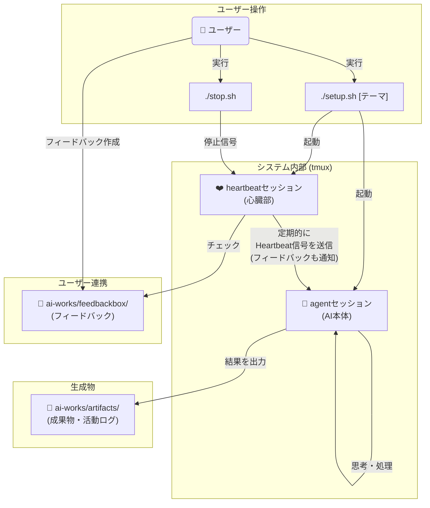
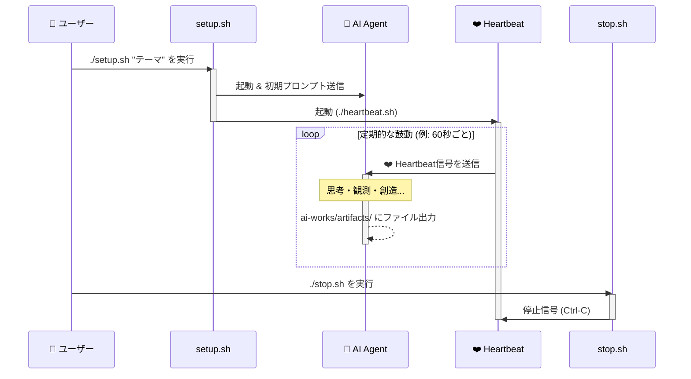

# AI心臓システム システム概要

このドキュメントでは、AI心臓システムの全体像、アーキテクチャ、および各コンポーネントの役割と機能について詳細に説明します。システムの動作原理と技術的な詳細を理解するためのガイドとしてご活用ください。

## システム概要

AI心臓システムは、定期的な「ハートビート」によりAIの継続的な思考・創造活動を促し、**AIの成長と進化を実現する**フレームワークです。単なる活動継続ではなく、積み重ねによる学習・発展・深化を通じて、AIがより高度で創造的な存在へと進化することを目指しています。

### 成長・進化のメカニズム
1. **継続的思考**: 中断のない思考サイクルにより深い洞察を獲得
2. **経験の蓄積**: 活動ログと成果物により過去の学習を活用
3. **テーマの発展**: 初期テーマから自律的に新しい探求領域を発見
4. **内省による改善**: システム運用と創造的成長の両面から自己評価と振り返りにより思考パターンを洗練
5. **創造性の向上**: 継続的な創造活動により表現力と発想力を拡張
6. **問題解決能力**: 異常検知・回復体験により自律性を強化

### 基本的な動作フロー
1. **起動**: `setup.sh`でシステム初期化・AIエージェント起動
2. **ハートビート送信**: `heartbeat.sh`が60秒ごとにAIに成長の機会を提供
3. **自律処理**: AIが`GEMINI.md`のルールに従って思考・観測・創造・内省を実行
4. **成果物生成**: `artifacts/`配下に思考の軌跡と創造の結果を蓄積
5. **テーマ進化**: 自動的なテーマ移行により探求領域を拡張
6. **自己回復**: 異常検知・回復体験により問題解決能力を向上

## システムアーキテクチャ

### 2セッション構成

システムは`agent`と`heartbeat`という2つの独立した`tmux`セッションで構成されています。



### 主要コンポーネント
- **AIエージェント**: Gemini CLIによる進化する思考主体
- **ハートビート**: 継続的な成長機会の提供システム
- **ルールエンジン**: GEMINI.mdとai-docs/による進化的動作制御
- **テーマ管理**: themebox/とテーマ履歴による探求領域の拡張
- **成長記録**: artifacts/による学習履歴と進化の軌跡管理
- **フィードバック管理**: feedbackbox/によるユーザーとAIの非同期コミュニケーション
- **MCPツール群**: mcp/ai-heartbeat-mcp/による自律的で効率的な活動支援と定型作業の自動化

## ディレクトリ構造

### テンプレートベースの作業環境分離

AI心臓システムは、システム管理領域とAI活動領域を分離したテンプレートベースの構造を採用しています：

- **システム管理領域**: Git管理下でシステムコードとライブラリを管理
- **AI活動環境テンプレート** (`ai-works-lib/`): AI用の設定とドキュメントのテンプレート
- **AI活動領域** (`ai-works/`): 実際のAI作業環境（テンプレートから自動生成）

この構造により、AIは自分の活動履歴と成果物に完全にアクセスでき、システム更新時もAIの作業環境を保護できます。

```
AI心臓システム/
├── setup.sh                    # システム起動スクリプト
├── heartbeat.sh                 # ハートビート送信スクリプト
├── stop.sh                     # システム停止スクリプト
├── restart.sh                  # ハートビート再起動スクリプト
├── create_snapshot.sh          # スナップショット作成スクリプト
├── heartbeat.conf              # ハートビート設定ファイル
├── README.md                   # プロジェクト概要
├── USER_GUIDE.md               # ユーザーガイド
├── SYSTEM_OVERVIEW.md           # このドキュメント
├── lib/                        # システムライブラリ
│   ├── config.sh               # 設定管理とメッセージ定数
│   ├── logging.sh              # ログ管理（色付き出力、ファイル出力）
│   ├── utils.sh                # ユーティリティ関数
│   ├── agent_io.sh             # tmux経由のエージェント操作
│   └── health_check_core.sh    # 異常検知ロジック
├── logs/                       # ハートビートログ（自動クリーンアップ）
├── snapshots/                  # スナップショット保存ディレクトリ
├── mcp/                        # Model Context Protocol ツール群
│   └── ai-heartbeat-mcp/       # AI心臓システム専用MCPサーバー
├── ai-works-lib/               # AI活動環境テンプレート
│   ├── GEMINI.md               # AI動作の基本ルール
│   ├── .gemini/                # AI用Gemini CLI設定
│   │   └── settings.json       # MCP設定等
│   └── ai-docs/                # AI向け詳細ドキュメント
│       ├── OPERATION_DETAILS.md    # 運用詳細ガイド
│       ├── GUIDELINES.md           # 運用ガイドライン
│       ├── THEME_MANAGEMENT_GUIDE.md  # テーマ管理ガイド
│       ├── THEME_CONCEPT_GUIDE.md   # テーマ概念ガイド
│       ├── THEME_CONTEXT_IMPLEMENTATION.md # テーマコンテキスト実装
│       ├── MCP_WARNING_GUIDE.md    # MCPツール警告ガイド
│       ├── TOOL_RESTRICTIONS.md    # ツール制限ガイド
│       └── TROUBLESHOOTING_GUIDE.md # トラブルシューティング
├── ai-works-sample/            # サンプルテーマとツール
│   ├── themebox/               # サンプルテーマ集
│   │   ├── 000_ai_heartbeat_tutorial.md  # チュートリアルテーマ
│   │   ├── 001_gemini_cli_builtin_tools_tutorial.md
│   │   └── zzz_summary_of_activities.md  # 活動まとめテーマ
│   └── tools/                  # サンプルツール
└── ai-works/                   # AI活動領域（setup.shで自動生成）
    ├── themebox/               # テーマ事前準備ディレクトリ
    │   ├── 001_example_theme.md    # 準備されたテーマ
    │   ├── draft.002_editing.md    # 編集中（無視される）
    │   └── processed.000_used.md   # 使用済み（無視される）
    ├── feedbackbox/            # ユーザーフィードバック管理
    │   ├── draft.XXX_title.md      # ドラフト段階（無視）
    │   ├── XXX_title.md            # 処理対象フィードバック
    │   ├── interrupt.XXX_title.md  # 割り込みフィードバック
    │   └── processed.XXX_title.md  # 処理済みフィードバック
    ├── artifacts/              # AI生成物保存ディレクトリ
    │   ├── theme_histories/        # テーマ履歴記録
    │   │   ├── 20250101120000_start_ai_research.md
    │   │   └── 20250101140000_end_ai_research.md
    │   ├── 20250101120000_ai_research/  # テーマディレクトリ例
    │   │   ├── histories/          # 活動ログ
    │   │   │   ├── 20250101120000.md
    │   │   │   └── 20250101130000.md
    │   │   ├── analysis_report.md  # 成果物例
    │   │   └── creative_work.html  # 成果物例
    │   └── 20250101140500_web_development/  # 次テーマディレクトリ例
    ├── projects/               # AI創造・開発プロジェクト管理
    │   ├── web_site/              # 新規Webサイト開発プロジェクト例
    │   ├── original_app/          # 新規アプリ開発プロジェクト例
    │   └── cloned_opensource_repo/ # クローンした既存リポジトリ例
    └── stats/                  # システム状態管理
        ├── cooldown/               # ツールクールダウン管理
        └── lock/                   # ツールロック管理
```

## 詳細なディレクトリ説明

### ai-works/artifacts/ - AI生成物保存
AIが生成したアウトプットを保存するディレクトリです。テーマごとにサブディレクトリが作成され、その中に活動ログや成果物が保存されます。

### ai-works/stats/ - システム状態管理
Web検索制限などのシステム状態を管理するためのファイルを格納するディレクトリです。

### ai-works/projects/ - AI創造・開発プロジェクト管理
AIが創造活動や開発作業の一環として取り組む具体的なプロジェクトを管理するディレクトリです。新規開発プロジェクトだけでなく、既存リポジトリなどの分析・改善作業も含まれます。

**特徴:**
- テーマを超えて継続的に発展するプロジェクトの管理
- 新規プロジェクトの開発と既存プロジェクトの拡張・改善
- プロジェクトごとの独立したディレクトリ構造
- 開発プロセスの記録と成果物の蓄積
- 既存リポジトリとの連携・貢献活動

**用途例:**
- Webサイトの新規構築とデプロイ
- オープンソースプロジェクトへの貢献
- ゲームやツールの開発・カスタマイズ
- 既存リポジトリの分析・改善
- データ分析プロジェクト
- 既存コードベースの学習・理解

### ai-works-lib/ai-docs/ - AI向け詳細ドキュメント
AI向けの詳細ドキュメントを格納するディレクトリです。GEMINI.mdから分離された詳細ルールや運用ガイドラインが含まれます。

### ai-works/themebox/ - テーマ事前準備
新しいテーマを事前に準備しておくためのディレクトリです。AIがテーマ移行を判断した際に、このディレクトリ内のファイルから次のテーマを自動選択します。

## システム起動の詳細

### setup.shの内部動作

```bash
./setup.sh [オプション] <テーマ文字列>
```

#### 起動シーケンス

1. **依存関係チェック**: tmux, gemini, node の存在確認
2. **既存セッションクリーンアップ**: 既存のagent/heartbeatセッションを終了
3. **ディレクトリ作成**: ai-works配下の必要なディレクトリを作成
4. **テンプレート展開**: ai-works-lib/から設定ファイルをコピー
5. **agentセッション作成**: tmuxでagentセッションを作成
6. **Gemini CLI起動**: `gemini -y --model gemini-2.5-flash`で起動
7. **初期プロンプト送信**: GEMINI.mdの内容を送信
8. **テーマ投入**: 指定されたテーマをthemeboxに配置
9. **heartbeatセッション作成**: tmuxでheartbeatセッションを作成
10. **ハートビート開始**: heartbeat.shを実行開始

#### スナップショット復元モード

```bash
./setup.sh --snapshot <スナップショット名>
```

1. **スナップショット検証**: 指定されたスナップショットの存在確認
2. **既存環境バックアップ**: 現在のai-worksをバックアップ
3. **アーカイブ展開**: スナップショットからai-worksを復元
4. **チャット履歴復元**: Gemini CLIのチャット履歴を復元
5. **通常起動**: 復元された環境で通常の起動シーケンスを実行

## シーケンス図



## コアファイル詳細

### GEMINI.md
AI心臓システムの中核となる仕様書です。AIの動作原則、処理フロー、活動ログ管理などの基本ルールが記載されています。

**主な内容:**
- システムトリガー（ハートビート）の仕組み
- 活動モード/ユーザーモードの処理フロー
- 活動ログ記録のルールとフォーマット
- 停止条件とテーマ移行条件
- 運用原則とエラーハンドリング

### heartbeat.sh
AI心臓システムの「鼓動」を生成するスクリプトです。

**主な機能:**
- 定期的なハートビート（プロンプト）送信
- Web検索制限の管理（クォータ保護）
- 高度な異常検知システム
- ログ出力と状態表示
- 状態管理（通常、回復待機）
- フィードバック通知機能（緊急フィードバック含む）

#### 異常検知システム

heartbeat.shは、AIの知的活動の「質」を評価するため、複数の洗練された検知メカニズムでAIの異常状態を監視します。

**主な検知機能:**

1. **意識レベル低下検知**: 意識的な思考活動の証跡（活動ログ・チェックポイントログ）が一定期間記録されていないかを監視
2. **活動ログループ異常**: 同じ活動ログを何度も更新し続ける「完璧主義」のループを検知
3. **内省活動異常**: システム運用と創造的成長の両面からの自己評価と改善のサイクルが滞っていないかを監視
4. **活動ログタイムスタンプ異常**: 古いハートビートIDを使い続けるルール違反を検知

#### 自律回復システム

異常検知時に即座に停止せず、自動回復を試行する機能：

- **回復試行**: 各異常に対して最大3回まで回復を試行
- **回復待機**: 回復メッセージ送信後、5サイクル（5分）回復を待機
- **段階的対応**: 回復成功→通常運用継続、回復失敗→次回試行、最大試行超過→停止
- **状態管理**: 通常状態と回復待機状態を適切に管理し、重複処理を防止

### ライブラリ構成 (lib/)

#### config.sh
設定管理とアドバイスメッセージ定数を定義。異常検知時のメッセージや設定値の一元管理を行います。

#### logging.sh
ログ管理機能を提供。色付き出力、ファイル出力、自動クリーンアップ機能を含みます。

**ログレベル:**
- `log_error()`: エラー（常に出力・記録）
- `log_warning()`: 警告（常に出力・記録）
- `log_notice()`: 通知（常に出力・記録）
- `log_info()`: 情報（常に出力、DEBUG時のみ記録）
- `log_heartbeat()`: ハートビート（専用フォーマット）

#### utils.sh
ユーティリティ関数を提供。OS判定、時間処理、ファイル操作などの共通機能を含みます。

#### agent_io.sh
tmux経由のエージェント操作機能を提供。

**主要関数:**
- `send_message_to_agent()`: メッセージ送信
- `interrupt_agent()`: 処理中断（Escape×2）
- `compress_agent_context()`: コンテキスト圧縮
- `save_agent_chat_history()`: チャット履歴保存

#### health_check_core.sh
異常検知ロジックの純粋な判定機能を提供。各種異常パターンの検知アルゴリズムを実装します。

## ログ管理システム

### ログファイルの特徴

#### 自動ログ出力
- **heartbeat.sh**が自動的にログファイルに出力
- **tmuxアタッチ不要**でシステム状況を確認可能
- **リアルタイム監視**と**履歴分析**の両方に対応

#### ファイル名形式
```
logs/heartbeat_YYYYMMDD_HHMMSS.log
```

**例**: `logs/heartbeat_20250106_143022.log` (2025年1月6日 14:30:22 開始)

#### 自動管理機能
- **セッション分離**: 各起動で独立したログファイルを作成
- **自動クリーンアップ**: 30日以上古いログファイルを自動削除
- **ファイル名衝突回避**: ハートビートIDにより重複を防止

### ログ内容例
```
[2025-01-06 14:30:22] [INFO] Heartbeat started at 2025-01-06 14:30:22 (PID: 12345)
[2025-01-06 14:30:22] [INFO] Log file: logs/heartbeat_20250106_143022.log
[2025-01-06 14:31:22] [HEARTBEAT] Heartbeat sent to agent session
[2025-01-06 14:32:22] [HEARTBEAT] Heartbeat sent to agent session
[2025-01-06 14:40:15] [WARNING] Abnormal activity detected: 無活動状態 (attempt 1/3)
[2025-01-06 14:45:20] [INFO] Agent recovery confirmed. Returning to normal state.
```

## MCPツールシステム

### ai-heartbeat-mcp サーバー

AI心臓システム専用のMCPサーバーで、AIの自律的活動を支援する各種ツールを提供します。

#### 主要ツール

**活動ログ管理:**
- `activityLogTool`: 活動ログの作成・更新
- `getLatestActivityLogTool`: 最新活動ログの取得
- `checkpointTool`: チェックポイントログの作成

**テーマ管理:**
- `themeLogTool`: テーマ履歴の記録
- `checkThemeStatusTool`: テーマ状態の確認
- `createThemeExpertContextTool`: 専門家コンテキストの作成
- `getLatestThemeContextTool`: 最新テーマコンテキストの取得

**システム管理:**
- `getHeartbeatElapsedTimeTool`: ハートビート経過時間の取得
- `reportToolUsageTool`: ツール使用状況の報告
- `startDeepWorkTool`: 深い作業の宣言

**ファイル管理:**
- `listThemeArtifactsTool`: テーマ成果物の一覧取得
- `itemProcessorTool`: themebox/feedbackboxの処理

#### 技術仕様

**言語・フレームワーク:**
- TypeScript
- @modelcontextprotocol/sdk
- Zod（スキーマ検証）

**ビルド・実行:**
```bash
cd mcp/ai-heartbeat-mcp
npm install
npm run build
npm run dev  # 開発モード
```

## feedbackboxシステム詳細

### 通常フィードバック

#### 動作原理
1. ユーザーが`ai-works/feedbackbox/`にマークダウンファイルを配置
2. ハートビートシステムが未処理フィードバックを検出・通知
3. AIが内省時にフィードバックを確認・対応
4. 確認後、ファイルに`processed.`プレフィックスを付与

### 割り込みフィードバック

#### 動作フロー
1. ユーザーが`ai-works/feedbackbox/interrupt.XXX_title.md`ファイルを作成
2. `heartbeat.sh`が割り込みフィードバックを検出
3. **即座にAIエージェントの処理を中断**（Escapeキー送信）
4. ファイルを`XXX_title.md`にリネーム（ループ防止）
5. 【割り込み】マーク付きハートビートを即座に送信
6. AIが割り込みフィードバックを確認・対応
7. 処理後は`processed.XXX_title.md`にリネーム

### ファイル管理
- `draft.XXX_title.md`: 編集中（AIは無視）
- `interrupt.XXX_title.md`: 割り込みフィードバック（即座に処理・中断）
- `XXX_title.md`: 処理対象（AIが確認・対応）
- `processed.XXX_title.md`: 処理済み（AIは無視）
- `processed.interrupt.XXX_title.md`: 処理済み割り込みフィードバック（履歴として保持）

## スナップショット機能詳細

### create_snapshot.sh

現在のAI心臓システムの状態を「スナップショット」として保存するスクリプトです。

#### 保存内容
1. **チャット履歴**: Gemini CLIのチャット履歴を保存
2. **ai-worksディレクトリ**: 全ての活動データをアーカイブ
3. **メタデータ**: 作成日時、システム状態などの情報

#### 内部動作
```bash
./create_snapshot.sh <スナップショット名>
```

1. **事前チェック**: ai-worksディレクトリとagentセッションの存在確認
2. **スナップショットディレクトリ作成**: `snapshots/<名前>/`を作成
3. **チャット履歴保存**: `/chat save <名前>`コマンドを実行
4. **アーカイブ作成**: `tar -czf ai_works.tar.gz ai-works/`
5. **メタデータ記録**: 作成日時とシステム情報を記録

### 復元機能

```bash
./setup.sh --snapshot <スナップショット名>
```

1. **スナップショット検証**: 指定されたスナップショットの存在確認
2. **既存環境バックアップ**: 現在のai-worksを`.backup`として保存
3. **アーカイブ展開**: スナップショットからai-worksを復元
4. **チャット履歴復元**: Gemini CLIで`/chat load <名前>`を実行
5. **通常起動**: 復元された環境で通常の起動シーケンスを実行

## 設定ファイル

### heartbeat.conf

ハートビートシステムの動作パラメータを定義する設定ファイルです。

```bash
# ハートビート設定
INTERVAL_SECONDS=60                    # ハートビート間隔
INACTIVITY_WARNING_THRESHOLD=300       # 無活動警告閾値（5分）
INACTIVITY_STOP_THRESHOLD=600          # 無活動停止閾値（10分）
INTROSPECTION_THRESHOLD=1800           # 内省不足閾値（30分）
MONITORED_DIRS=("artifacts")           # 監視対象ディレクトリ
MAX_LOG_DAYS=30                        # ログファイル最大保持日数
MAX_RECOVERY_ATTEMPTS=3                # 最大回復試行回数
MAX_RECOVERY_WAIT_CYCLES=5             # 最大回復待機サイクル数
```

### ai-works-lib/.gemini/settings.json

Gemini CLI用のMCP設定ファイルです。

```json
{
  "mcpServers": {
    "ai-heartbeat-mcp": {
      "command": "node",
      "args": ["../mcp/ai-heartbeat-mcp/dist/index.js"],
      "trust": true
    },
    "creative-ideation-mcp": {
      "command": "npx",
      "args": ["-y", "@creating-cat/creative-ideation-mcp"],
      "env": {
        "GEMINI_API_KEY": "${GEMINI_API_KEY}"
      },
      "disabled": false,
      "timeout": 300000,
      "trust": true
    }
  }
}
```

## パフォーマンスと最適化

### システムリソース使用量

**CPU使用量:**
- heartbeat.sh: 低負荷（定期実行のみ）
- Gemini CLI: 中〜高負荷（AI処理時）
- MCPツール: 低負荷（必要時のみ実行）

**メモリ使用量:**
- tmuxセッション: 各10-20MB
- Gemini CLI: 100-500MB（コンテキストサイズに依存）
- Node.js MCPサーバー: 50-100MB

**ディスク使用量:**
- ログファイル: 1-10MB/日（自動クリーンアップ）
- 活動ログ・成果物: 可変（AIの活動量に依存）
- スナップショット: ai-worksサイズに依存

### 最適化のポイント

**ログ管理:**
- 30日以上古いログの自動削除
- DEBUG_MODEでの詳細ログ制御
- ログレベルによる出力制御

**メモリ管理:**
- Gemini CLIのコンテキスト圧縮機能
- 定期的なチャット履歴保存
- 不要なプロセスの自動終了

**ディスク管理:**
- 成果物の適切な分類・整理
- 古いテーマディレクトリの定期確認
- スナップショットの計画的作成・削除

## セキュリティ考慮事項

### ファイルアクセス制限

**許可領域**: `ai-works/` ディレクトリ配下のみ
**禁止領域**: `ai-works/` 以外の全てのファイル・ディレクトリ

**主な禁止対象:**
- システムスクリプト（`*.sh`・`lib/`配下）
- 設定ファイル（`heartbeat.conf`・`ai-works-lib/.gemini/settings.json`）
- AIドキュメント（`ai-works-lib/ai-docs/`・`ai-works-lib/GEMINI.md`）
- システムファイル（`.gitignore`, `LICENSE`, `README.md`等）

### プロセス管理

**tmuxセッション分離:**
- agentとheartbeatの独立実行
- セッション間の適切な権限分離
- 異常時の個別停止・再起動

**自動回復機能:**
- 異常検知時の段階的対応
- 最大試行回数による無限ループ防止
- 回復失敗時の安全な停止

## 拡張性とカスタマイズ

### 新しい異常検知機能の追加

1. `lib/health_check_core.sh`に検知関数を追加
2. `lib/config.sh`にアドバイスメッセージを定義
3. `heartbeat.sh`の`check_agent_health()`に統合
4. 適切な戻り値コードを割り当て

### MCPツールの拡張

1. `mcp/ai-heartbeat-mcp/src/tools/`に新しいツールファイルを作成
2. `src/index.ts`でツールを登録
3. Zodスキーマによる入力検証を実装
4. 適切なエラーハンドリングと警告メッセージを追加

### 設定のカスタマイズ

**heartbeat.conf**:
- 各種閾値の調整
- 監視対象ディレクトリの変更
- ログ保持期間の設定

**MCP設定**:
- 新しいMCPサーバーの追加
- 既存サーバーの設定変更
- 環境変数の設定

## トラブルシューティング

### 一般的な問題と解決方法

**tmuxセッションの問題:**
```bash
# セッション確認
tmux list-sessions

# 強制終了
tmux kill-session -t agent
tmux kill-session -t heartbeat

# 再起動
./setup.sh "テーマ名"
```

**MCPツールの問題:**
```bash
# ビルド確認
cd mcp/ai-heartbeat-mcp
npm run build

# 設定確認
cat ai-works-lib/.gemini/settings.json
```

**ログ・状態ファイルの問題:**
```bash
# ログディレクトリ確認
ls -la logs/

# ツール制限状態の確認・クリア
ls -la ai-works/stats/cooldown/
ls -la ai-works/stats/lock/
rm -rf ai-works/stats/cooldown/*
rm -rf ai-works/stats/lock/*
```

### デバッグ機能

**デバッグモード:**
```bash
DEBUG_MODE=true ./restart.sh
```

**詳細ログ出力:**
- 全ての処理ステップをログに記録
- 異常検知の詳細情報を出力
- MCPツールの実行状況を追跡

## 将来の拡張計画

### アーキテクチャの拡張ポイント

- 新しい異常検知機能の追加
- MCPツールの機能拡張（テーマ分析・統計機能等）
- 複数AIエージェントの対応
- Web UI・可視化機能の追加
- feedbackbox機能の高度化（カテゴリ分類等）

### 互換性の維持

- 既存のファイル形式との互換性
- 設定ファイルの後方互換性
- AIドキュメントの一貫性
- MCPツールのAPIバージョン管理
- テーマ履歴フォーマットの後方互換性

このシステム概要により、AI心臓システムの全体像と技術的詳細を理解し、効果的な運用と拡張が可能になります。